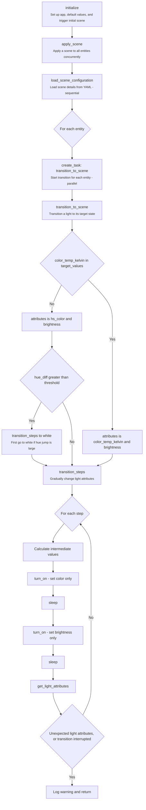

## Flow

```mermaid
flowchart TD
    A[initialize<br><sub>Set up app, default values, and trigger initial scene</sub>]
    A --> B[apply_scene<br><sub>Apply a scene to all entities concurrently</sub>]
    B --> C[load_scene_configuration<br><sub>Load scene details from YAML - sequential</sub>]
    C --> D{For each entity}
    D --> E[create_task: transition_to_scene<br><sub>Start transition for each entity - parallel</sub>]
    E --> F[transition_to_scene<br><sub>Transition a light to its target state</sub>]
    F --> G{color_temp_kelvin in target_values}
    G -- Yes --> H[attributes is color_temp_kelvin and brightness]
    G -- No --> I[attributes is hs_color and brightness]
    I --> J{hue_diff greater than threshold}
    J -- Yes --> K[transition_steps to white<br><sub>First go to white if hue jump is large</sub>]
    K --> L[transition_steps to target<br><sub>Then go to target color</sub>]
    J -- No --> L
    H --> L
    L[transition_steps<br><sub>Gradually change light attributes</sub>]
    L --> M{For each step}
    M --> N[Calculate intermediate values]
    N --> O[turn_on - set color only]
    O --> P[sleep]
    P --> Q[turn_on - set brightness only]
    Q --> R[sleep]
    R --> S[get_light_attributes]
    S --> T{Unexpected light attributes, or transition interrupted}
    T -- Yes --> U[Log warning and return]
    T -- No --> M
```