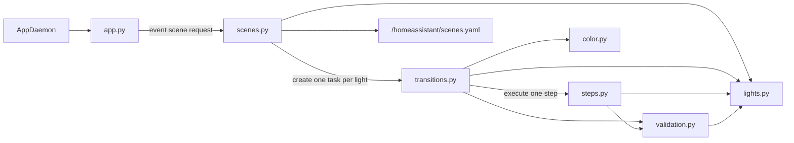
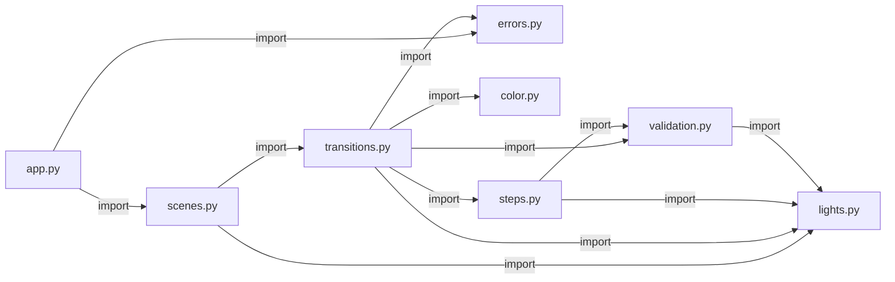
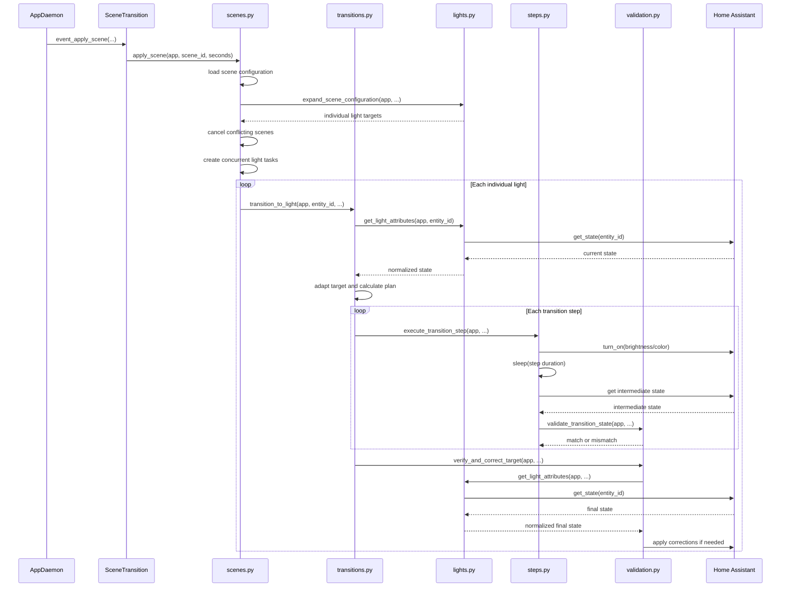

## Architecture

### Easy overview

```mermaid
flowchart LR
    AD["AppDaemon"] --> APP["app.py"]
    APP -->|"event scene request"| SCENES["scenes.py"]
    SCENES -->|"create one task per light"| TRANSITIONS["transitions.py"]
    TRANSITIONS -->|"execute one step"| STEPS["steps.py"]

    SCENES --> LIGHTS["lights.py"]
    TRANSITIONS --> LIGHTS
    TRANSITIONS --> VALIDATION["validation.py"]
    STEPS --> VALIDATION
    STEPS --> LIGHTS
    VALIDATION --> LIGHTS
    TRANSITIONS --> COLOR["color.py"]
    SCENES --> YAML["/homeassistant/scenes.yaml"]
```

### Module dependencies

```mermaid
flowchart LR
    APP["app.py"] -->|"import"| SCENES["scenes.py"]
    APP -->|"import"| ERRORS["errors.py"]
    SCENES -->|"import"| LIGHTS["lights.py"]
    SCENES -->|"import"| TRANSITIONS["transitions.py"]
    TRANSITIONS -->|"import"| COLOR["color.py"]
    TRANSITIONS -->|"import"| ERRORS
    TRANSITIONS -->|"import"| LIGHTS
    TRANSITIONS -->|"import"| STEPS["steps.py"]
    TRANSITIONS -->|"import"| VALIDATION["validation.py"]
    STEPS -->|"import"| LIGHTS
    STEPS -->|"import"| VALIDATION
    VALIDATION -->|"import"| LIGHTS
```

### Runtime sequence

```mermaid
sequenceDiagram
    participant AD as AppDaemon
    participant App as SceneTransition
    participant Scenes as scenes.py
    participant Transition as transitions.py
    participant Lights as lights.py
    participant Steps as steps.py
    participant Validation as validation.py
    participant HA as Home Assistant

    AD->>App: event_apply_scene(...)
    App->>Scenes: apply_scene(app, scene_id, seconds)
    Scenes->>Scenes: load scene configuration
    Scenes->>Lights: expand_scene_configuration(app, ...)
    Lights-->>Scenes: individual light targets
    Scenes->>Scenes: cancel conflicting scenes
    Scenes->>Scenes: create concurrent light tasks

    loop Each individual light
        Scenes->>Transition: transition_to_light(app, entity_id, ...)
        Transition->>Lights: get_light_attributes(app, entity_id)
        Lights->>HA: get_state(entity_id)
        HA-->>Lights: current state
        Lights-->>Transition: normalized state
        Transition->>Transition: adapt target and calculate plan

        loop Each transition step
            Transition->>Steps: execute_transition_step(app, ...)
            Steps->>HA: turn_on(brightness/color)
            Steps->>Steps: sleep(step duration)
            Steps->>HA: get intermediate state
            HA-->>Steps: intermediate state
            Steps->>Validation: validate_transition_state(app, ...)
            Validation-->>Steps: match or mismatch
        end

        Transition->>Validation: verify_and_correct_target(app, ...)
        Validation->>Lights: get_light_attributes(app, ...)
        Lights->>HA: get_state(entity_id)
        HA-->>Lights: final state
        Lights-->>Validation: normalized final state
        Validation->>HA: apply corrections if needed
    end
```

### Detailed runtime flow

```mermaid
flowchart TD
    A[initialize<br><sub>Register app event listener and defaults</sub>]
    A --> B[apply_scene]
    B --> C[load_scene_configuration<br><sub>Read scene targets from scenes.yaml</sub>]
    C --> D[expand_scene_configuration]
    D --> E{Scene entity is a group?}
    E -- No --> F{Individual light available?}
    F -- Yes --> G[Keep individual light target]
    F -- No --> H[Skip unavailable or unknown entity]
    E -- Yes --> I[Expand group_entities recursively]
    I --> J[Deduplicate members and skip unavailable entities]
    J --> K[Use individual members as targets]
    G --> L[Find active scenes sharing target lights]
    K --> L
    H --> L
    L --> M[Cancel conflicting scene tasks]
    M --> N[create_task for each individual light<br><sub>Transitions run concurrently</sub>]
    N --> O[transition_to_light]
    O --> P{Light available?}
    P -- No --> Q[Log warning and skip]
    P -- Yes --> R[adapt_target_to_light<br><sub>Choose HS/XY or color_temp_kelvin<br>and convert HS for Kelvin-only lights</sub>]
    R --> S{Already at target?}
    S -- Yes --> T[Log and skip transition]
    S -- No --> U[Calculate step and phase plan]
    U --> V{Large hue difference?}
    V -- Yes --> W[Plan white phase, then target phase]
    V -- No --> X[Plan direct target phase]
    W --> Y[execute_transition_step]
    X --> Y
    Y --> Z[Interpolate and apply each step<br><sub>• Calculate intermediate values<br>• Brightness and color share the step duration when both change<br>• If only one attribute transitions, then sleep for double duration<br>• Apply brightness, sleep, then apply color, sleep<br></sub>]
    Z --> AA[Validate intermediate state]
    AA --> AB{Validation failed or light turned off?}
    AB -- Yes --> AC[Raise error and cancel remaining scene tasks]
    AB -- No --> AD{More steps?}
    AD -- Yes --> Y
    AD -- No --> AE[verify_and_correct_target<br><sub>Check the device-reported final state</sub>]
    AE --> AF{Final state differs from target tolerance?}
    AF -- Yes --> AG[Apply sequential brightness, Kelvin, or HS corrections<br><sub>Device correction for reported mismatch</sub>]
    AF -- No --> AH[Log transition completed]
    AG --> AH
```