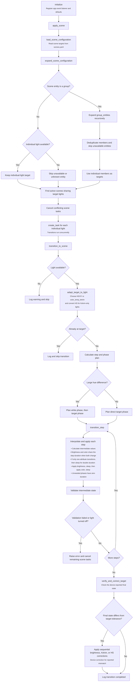

## Flow

```mermaid
flowchart TD
    A[initialize<br><sub>Register app event listener and defaults</sub>]
    A --> B[apply_scene]
    B --> C[load_scene_configuration<br><sub>Read scene targets from scenes.yaml</sub>]
    C --> D[expand_scene_configuration]
    D --> E{Scene entity is a group?}
    E -- No --> F{Individual light available?}
    F -- Yes --> G[Keep individual light target]
    F -- No --> H[Skip unavailable or unknown entity]
    E -- Yes --> I[Expand group_entities recursively]
    I --> J[Deduplicate members and skip unavailable entities]
    J --> K[Use individual members as targets]
    G --> L[Find active scenes sharing target lights]
    K --> L
    H --> L
    L --> M[Cancel conflicting scene tasks]
    M --> N[create_task for each individual light<br><sub>Transitions run concurrently</sub>]
    N --> O[transition_to_scene]
    O --> P{Light available?}
    P -- No --> Q[Log warning and skip]
    P -- Yes --> R[adapt_target_to_light<br><sub>Choose HS/XY or color_temp_kelvin<br>and convert HS for Kelvin-only lights</sub>]
    R --> S{Already at target?}
    S -- Yes --> T[Log and skip transition]
    S -- No --> U[Calculate step and phase plan]
    U --> V{Large hue difference?}
    V -- Yes --> W[Plan white phase, then target phase]
    V -- No --> X[Plan direct target phase]
    W --> Y[transition_step]
    X --> Y
    Y --> Z[Interpolate and apply each step<br><sub>• Calculate intermediate values<br>• Brightness and color share the step duration when both change<br>• If only one attribute transitions, then sleep for double duration<br>• Apply brightness, sleep, then apply color, sleep<br>• Unneeded phases have zero duration</sub>]
    Z --> AA[Validate intermediate state]
    AA --> AB{Validation failed or light turned off?}
    AB -- Yes --> AC[Raise error and cancel remaining scene tasks]
    AB -- No --> AD{More steps?}
    AD -- Yes --> Y
    AD -- No --> AE[verify_and_correct_target<br><sub>Check the device-reported final state</sub>]
    AE --> AF{Final state differs from target tolerance?}
    AF -- Yes --> AG[Apply sequential brightness, Kelvin, or HS corrections<br><sub>Device correction for reported mismatch</sub>]
    AF -- No --> AH[Log transition completed]
    AG --> AH
```